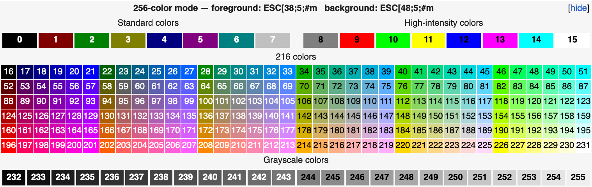

# エイリアス
> last update: {sub-ref}`today`

コマンドラインを使用している場合、頻繁に使用するコマンドがあるはずです。
一部のコマンドは長く、毎回コピーするのは時間の無駄かもしれません。そのような場合には、コマンドの `alias` を作ると良いでしょう。`h` を `cd ~` のエイリアスとして使用したい場合、`alias h='cd ~'` と `~/.zshrc`（または `~/.bashrc`）に定義します（`=` の両側にはスペースを入れません）。ホームディレクトリにそのようなファイルが見つからない場合は、`touch ~/.zshrc` で作る必要があります。

以下で便利なエイリアスがいくつか見つかった場合、`~/.zshrc` に記述してください。


## 基本
### プロンプトのカスタマイズとカラー表示
```bash
PS1="%F{082}%n%f %F{051}%~%f %# "
RPROMPT='%T'
```

- `PS1` はメイン（左）プロンプトであり、`RPROMPT` は右プロンプトです。
- `%n` はユーザー名を意味します
- `%~` は現在のディレクトリを意味します
- `%#` はルートユーザーの場合に `#`、それ以外の場合に `%` を表示します。
- `%T` は現在の時刻を24時間形式で表示します（12時間形式の場合は `%t`）。
- `%F{color number}` 〜 `%f` を使用してプロンプトをカラー表示できます。カラー番号は以下の通りです。([wikipedia](https://en.wikipedia.org/wiki/ANSI_escape_code#8-bit)より)


Prompt Expansionについては、[こちらのリンク](https://zsh.sourceforge.io/Doc/Release/Prompt-Expansion.html)を参照してください。


### プロンプトの前に空行を挿入する。
```bash
precmd() { precmd() { echo } }
```


### ディレクトリの変更
```bash
cs() { cd $@ && la }
alias cd='cs'
alias ..='cd ..'
alias ...='cd ../..'
alias ....='cd ../../..'
alias cb='cd -'
alias d='cd ~/Desktop'
alias dl="cd ~/Downloads"
alias h='cd ~'
alias /='cd /'

# 最上位のFinderウィンドウの位置に作業ディレクトリを変更します。
cdf() { cd "$(osascript -e 'tell app "Finder" to POSIX path of (insertion location as alias)')" }
```


### ファイルの表示
```bash
#alias ls='ls -F'
alias ls='gls --color --group-directories-first -F'
alias l='ls'
alias la='ls -A'
alias ll='ls -AhlS'
alias ds='du -d 1 -h 2>/dev/null | sort -h'
alias pwd='sed "s/ /\\\ /g" <<< ${PWD/#$HOME/"~"}'
alias p='pwd'
alias path='echo -e ${PATH//:/\\n}'
```
- `ls`: `gls` を使用するには、`brew install coreutils` で `coreutils` をインストールする必要があります。`tree` コマンドと同じカラー表示にできます。
	- `--color` オプションは `gls` コマンドの出力をカラー表示させます。
	- `--group-directories-first` オプションはディレクトリを先に表示させます。
	- `-F` オプションはディレクトリ名に `/`、シンボリックリンクに `@` などの末尾記号を追加します。

- `la`、`ll`: `ls` は `gls --color --group-directories-first -F` と定義されており、その後に `la='ls -A'` が定義されています。つまり、`la='gls --color --group-directories-first -F -A'` と解釈されることになります。`ll` も同様です。
	- `-A` オプションは `.` と `..` 以外のすべてのファイルとディレクトリを表示します。
	- `-h` オプションはわかりやすい形式でファイルサイズを表示します。
	- `-l` オプションはファイルのサイズ、所有者、グループ、パーミッションを表示します。
	- `-S` オプションはファイルサイズでソートします。
- `ds`: `du -d 1` は現在のディレクトリ内のディレクトリのサイズを表示します。
	- `-h` オプションはわかりやすい形式でファイルサイズを表示します。
	- `2>/dev/null` はエラーメッセージを非表示にします。
	- `sort -h` はファイルサイズでソートします。
- `pwd`：`sed "s/ /\\\ /g"` はファイルパスのすべてのスペースの前に `\` を置いて、空白をエスケープします。`<<<` は "here string" です。`${PWD/#$HOME/"~"}` は現在のディレクトリパス内の `$HOME` を `~` に置換します。

```{hint}
オプションを指定する際は、`ls -A -h -l -S` の代わりに `ls -AhlS` と指定できます。
```


### ファイルの編集
```bash
alias v='vi'
alias cp='cp -iv'
alias mv='mv -iv'
alias rm='rm -iv'
alias rf='rm -rf'
```
- `-i` オプションはファイルを上書きする前に確認をさせます。
- `-v` オプションはコピー、移動、削除されるファイルの名前を表示させます。


### 検索
```bash
fb() { find . -size +$2M -type f -name $1 -exec ls -lhS "{}" +}
fd() { find . -name "*.$1" -type f -delete }
rn() { for filename in *.$1; do mv -f "$filename" $(echo "$filename" | sed -e "s/$2//g"); done }
dif(){ diff --color -u $1 $2 }
alias imgopt='open -a ImageOptim .'
alias grep='grep --color'
```
```{note}
引数を伴うエイリアス、すなわち関数を作成できます。関数は `function_name() { commands }` の形式で定義されます。例えば、`fb` は `$1` と `$2` の2つの引数を受け取ります。`$1` は最初の引数であり、`$2` は2番目の引数です。`fb "*.pdf" 10` のように使用して、10 MB より大きい `pdf` という拡張子のファイルを検索します。

`$1` と `$2` に加えて、他にも特別な変数があります：`$0` は関数名、`$@` はすべての引数、`$#` は引数の数、`$?` は直近のコマンドの終了ステータス、`$$` は現在のシェルのプロセス ID、`$!` は直近のバックグラウンドコマンドのプロセス ID です。
```

- `fb` は現在のディレクトリ内で、サイズが `$2` MB を超える `$1` という名前のファイルを検索します。
	- `-size +$2M` オプションは `$2` MB を超えるファイルを検索します。
	- `-type f` オプションはファイルのみを検索します（`-type d` はディレクトリのみを検索します）。
	- `-name $1` オプションは、`$1` のファイルを検索します。ある拡張子のファイルを検索する場合は、`-name "*.$1"` と指定します。
	- `-exec ls -lhS "{}" +` オプションは各検索されたファイルに対して `ls -lhS` コマンドを実行します。
- `fd`: `find . -name "*.$1" -type f -delete` は拡張子が `$1` のファイルを検索して削除します。
- `rn` は拡張子が `$1` のファイルを、ファイル名から `$2` を削除して名前を変更します。例えば、`rn txt asdf` は `aaasdfff.txt` を `aaff.txt` に変更します。

```{note}
`-exec <command> {} +` は、検索された各ファイルに対して `<command>` を実行するための構文です。`{}` はファイル名のプレースホルダーです。`+` はコマンドの終了を示す区切り文字です。
```


### アプリケーションの起動
```bash
alias hr='open .'
alias c='open /Applications/CotEditor.app'
alias vs='code'
alias fire='open /Applications/Firefox.app'
alias chrome='open /Applications/Google\ Chrome.app'
alias safari='open /Applications/Safari.app'
```

- `hr` は現在のディレクトリを Finder で開きます。
- `c` は CotEditor を起動します。
- `vs` は Visual Studio Code を起動します。
- `fire` は Firefox を起動します。
- `chrome` は Google Chrome を起動します。
- `safari` は Safari を起動します。


### その他
```bash
alias his='history'
alias rl='exec ${SHELL} -l' #reload
```


### ZIP 暗号化
```
zipen(){
	zip -er enc.zip "$@"
}
```

- `zipen` はファイルやディレクトリ（引数は複数も可）を暗号化して `enc.zip` に圧縮します。`zipen file1 file2 dir1` のように使用します。

```{note}
`"$@"` はすべての引数を表します。上の例では、`"$@"` は `file1 file2 dir1` に展開されます。
```

## Mac OS 設定
### Finderで隠しファイルを表示/非表示にする
```bash
alias show="defaults write com.apple.finder AppleShowAllFiles -bool true && killall Finder"
alias hide="defaults write com.apple.finder AppleShowAllFiles -bool false && killall Finder"
```
```{note}
Finderで隠しファイルを表示/非表示にするには、`Command + Shift + .` も使用できます。
```


### デスクトップのアイコンをすべて非表示/表示する
```bash
alias dhide="defaults write com.apple.finder CreateDesktop -bool false && killall Finder"
alias dshow="defaults write com.apple.finder CreateDesktop -bool true && killall Finder"
```


### スクリーンショットの設定
```bash
alias dwl='defaults write com.apple.screencapture location'
alias ddl='defaults delete com.apple.screencapture location'
alias drl='defaults read com.apple.screencapture location'
```
スクリーンショットの保存場所を `dwl ~/path/to/dir` で変更できます。


### スリープ設定
```bash
alias sleepon='sudo pmset -a disablesleep 0'
alias sleepoff='sudo pmset -a disablesleep 1'
```


## GitHub
```bash
alias g='git'
alias ga='git add'
alias gb='git branch'
alias gc='git commit'
alias gch='git checkout'
alias gcl='git clone'
alias gd='git diff'
alias gf='git fetch'
alias gi='git init'
alias gm='git merge'
alias gps='git push'
alias gpl='git pull'
alias gpom='git push origin main'
alias gs='git status'
```


### 関数
```bash
gacpm() { git add -A && git commit -m "$1" && git push origin main }
```

- `gacpm` は、`git add -A`、`git commit -m "$1"`、`git push origin main` を実行します。`$1` はコミットメッセージで、`gacpm` の後に引数として渡します。`gacpm "update README.md"` のように使用します。


また、次のように新しいリポジトリを1つのコマンドで作成する関数を定義できます。
```bash
# $1 = private or public
ginit() {
	git init
	git add .
	git commit -m "🎉  Initial commit"
	gh repo create --"$1" --source=. --push
}
```
`gh` コマンドを使用するには、[GitHub CLI](https://cli.github.com/) をインストールする必要があります。


### gitignore.io
gitignore.io を使用して .gitignore ファイルを簡単に作成できます
```bash
function gi() { curl -sLw n https://www.toptal.com/developers/gitignore/api/$@ ;}
```


## Python
```bash
alias wpy='which python'

alias pip='pip3'
alias pin='pip install'
alias puin='pip uninstall'
alias pup='pip install --upgrade pip'
alias pinreq='pip install -r requirements.txt'
alias pf='pip list --format=freeze'
alias pfr='pip list --format=freeze > requirements.txt'
```


### 仮想環境の作成、アクティベート、ディアクティベート
```bash
alias mkv='python3 -m venv venv; acv; pip install --upgrade pip'
alias acv='source venv/bin/activate'
alias deac='deactivate'
```


## LaTeX
### latex-template ディレクトリをコピー
LaTeX ドキュメントを作成することが多い場合、テンプレートディレクトリを作成すると便利です。この関数を使用して、テンプレートディレクトリを任意の場所にコピーできます。
```bash
mklt(){
	cp -r ~/latex-template ./"$1"
}

mkbt(){
	cp -r ~/beamer-template ./"$1"
}
```